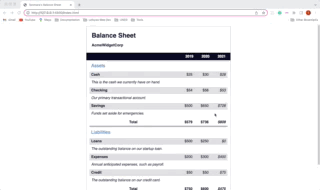

# BALANCE SHEET APP

The application was built as a practice project for a responsive web design course with FreecodeCamp. It features a balance sheet of AmeWidgetCorp with information on Assets, Liabilities and Net Worth.

## Features

- Table with balance information of AcmeWidgetCorp
- Description of Assets yearly with total
- Description of Liabilities yearly with total
- Total rows with hovering effect

## Technologies

- HTML
- CSS

## Start the App

In the project directory, you can run it with the Live Server by right-clicking on the index.html.

It will run the app in the development mode.\
Open [http://127.0.0.1:5500](http://127.0.0.1:5500/index.html) to view it in your browser.

When making changes, make sure you reload to see it on the page.

### Author

[Tanimara Elias Santos](https://github.com/tanimaraeliassantos)

### Version

1.0.0
